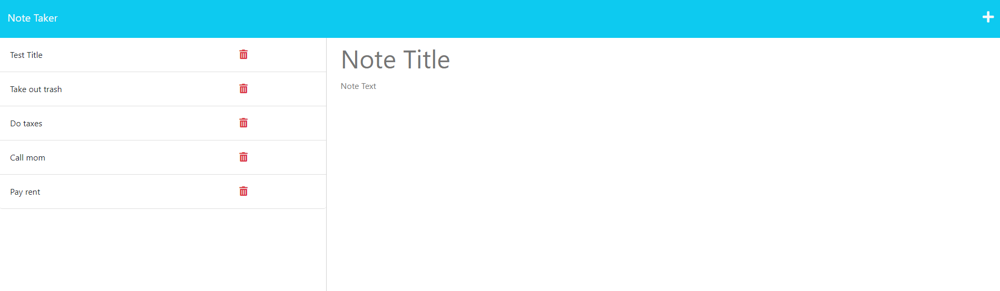

# Note Taker
A note taker application that is used to write and save notes in a database.

## Description

This challenge was to create a web application where you can create and store notes in one database to easily keep track of your daily tasks and reminders of things that need to be done. This application uses HTML, CSS, JavaScript, Node.js, and Express.js to make the magic happen!

## Links

- GitHub Repository: https://github.com/blakeedwards3/note-taker
- Link to application: 

## Usage

1. Click "Get Started" on the main page to go to the notes page!
2. Type a note title and description
3. Click the save button in the top right to save your note in the list
4. Click the red trash can beside a note to delete it

## Credits

Below is a list of a few resources I used to help complete the assignment and better understand what the code is doing.
- Project 2 from the UNCC coding bootcamp helped a lot
- https://developer.mozilla.org/en-US/docs/Learn/Server-side/Express_Nodejs/routes
- https://www.geeksforgeeks.org/express-js-express-router-function/#
- https://www.geeksforgeeks.org/how-to-build-note-taking-application-using-node-js/
- https://www.w3schools.com/tags/ref_httpmethods.asp